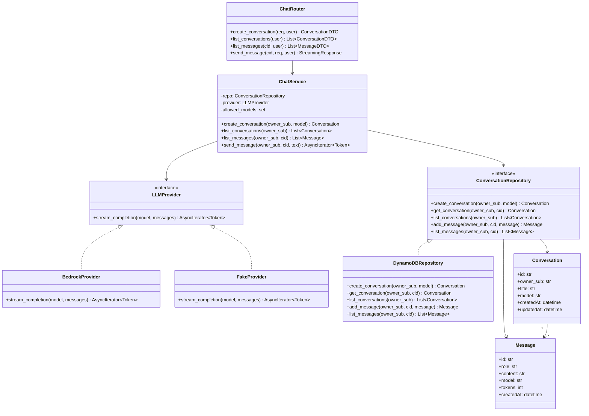
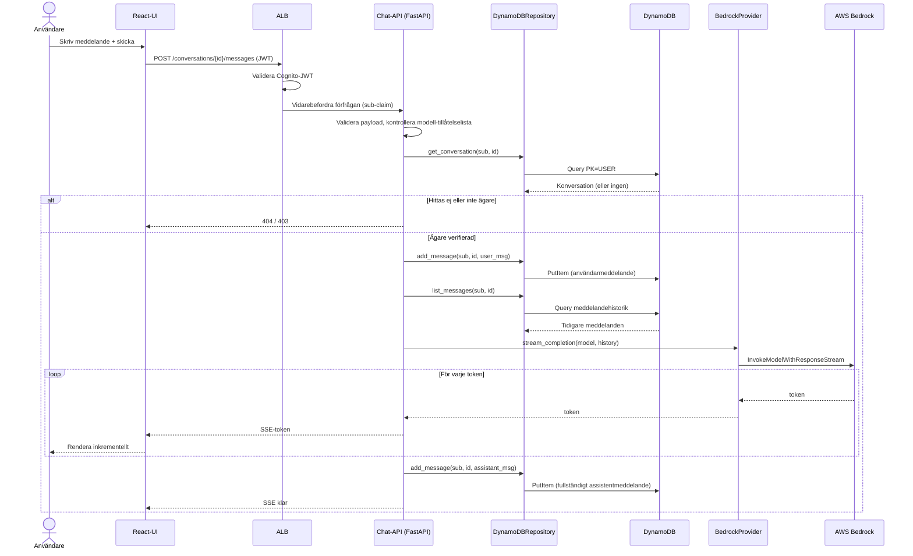

# AI-chattjänst — Arkitektur

En liten tjänst där en användare kan chatta med en LLM, med konversationshistorik
som lagras permanent. Byggd för att demonstrera ren struktur, tydliga gränssnitt och
en realistisk väg till kommersiell användning.

## 1. Arkitekturöversikt

En liten uppsättning fokuserade tjänster, rent lagerindelade, i en distribuerad /
mikroarkitekturstil:

```
                        ┌──────────────────────┐
                        │   React + Tailwind    │  (SPA på S3 + CloudFront)
                        └──────────┬───────────┘
                                   │ HTTPS + JWT (Cognito-tokens), SSE för strömning
                                   ▼
                        ┌──────────────────────┐
                        │   ALB                 │  (validerar Cognito-JWT)
                        └──────────┬───────────┘
                                   ▼
            ┌──────────────────────────────────────────────┐
            │      Chat-API-tjänst (FastAPI på Fargate)     │
            │  - Konversations- och meddelande-endpoints    │
            │  - AuthZ-kontroll (ägare = sub-claim)         │
            │  - Orkestrerar persistens + inferens           │
            └───────┬───────────────────────────┬──────────┘
                    │                            │
          ┌─────────▼─────────┐        ┌─────────▼──────────┐
          │  LLM-integration   │       │   Dataåtkomst      │
          │  (LLMProvider-IF → │       │  (Repository-IF →  │
          │   BedrockProvider) │       │   DynamoDBRepo)    │
          └─────────┬─────────┘        └─────────┬──────────┘
                    ▼                            ▼
            ┌───────────────┐          ┌───────────────────┐
            │  AWS Bedrock  │          │     DynamoDB      │
            │ (modell vald  │          │ enkel tabell      │
            │  av användare)│          │                   │
            └───────────────┘          └───────────────────┘
```

FastAPI-tjänsten är uppdelad i tre utbytbara lager — detta är kärnan i
"evolverbarhets"-argumentet, och varje gränssnitt är en plats där man kan dela upp
i en separat tjänst eller byta leverantör utan att röra resten:

1. **API-lager** — routing, scheman för förfrågan/svar, autentiseringskontroll,
   felmappning. Vet ingenting om Bedrock eller DynamoDB.
2. **LLM-integrationslager** — ett `LLMProvider`-gränssnitt med en
   `BedrockProvider`-implementation. Att byta eller lägga till en leverantör är en
   ny klass.
3. **Dataåtkomstlager** — ett `ConversationRepository`-gränssnitt med en
   `DynamoDBRepository`-implementation. Att byta datalager är en ny klass.

## 2. Teknikval

| Område     | Val                                 | Motivering                                                                        |
| ---------- | ----------------------------------- | --------------------------------------------------------------------------------- |
| Backend    | **Python + FastAPI**                | Async passar LLM-latens, Pydantic-validering, automatisk OpenAPI-dokumentation.   |
| Inferens   | **AWS Bedrock**                     | Hanterad, IAM-avgränsad, ingen rotation av tredjepartsnycklar, data stannar i kontot. |
| Modell     | **Användarvald (tillåtelselistad)** | Användaren väljer modellen; tjänsten upprätthåller en serverside-tillåtelselista. |
| Databas    | **DynamoDB (on-demand)**            | Serverlös, ensiffrig ms nyckelåtkomst, skala-till-noll-kostnad, strukturell isolering. |
| Auth       | **Amazon Cognito**                  | Hanterad user pool som utfärdar JWT:er; `sub`-claimen är tenancy-nyckeln.          |
| Frontend   | **React + Tailwind**                | Komponentmodellen passar chatt; Tailwind för snabb, enhetlig styling.             |
| Beräkning  | **AWS Fargate**                     | Långlivad container strömmar tokens (SSE) naturligt; inga kallstarter.            |
| IaC        | **AWS CDK**                         | Typad, testbar infrastruktur i ett språk tillsammans med appen.                   |
| Paketering | **Docker** per tjänst               | Reproducerbar körbar lösning; compose lokalt, Fargate i AWS.                       |
| Lokal utveckling | **docker-compose** + DynamoDB Local + `FakeProvider` | Granskaren kör allt utan AWS-konto.                          |

### Varför DynamoDB

- **Kostnad i detta sammanhang:** on-demand-debitering + 25 GB gratis lagring → en
  inaktiv demo kostar i praktiken ingenting, jämfört med ~$20–45 för att hålla en
  serverlös SQL-motor varm i två veckor.
- **Passar åtkomstmönstret:** chatt är skrivtung, ägaravgränsad, nyckelbaserade
  läsningar — DynamoDB:s styrka.
- **Noll drift / förutsägbar latens** i vilken skala som helst.
- **Tenantisolering är strukturell** (partitionerad per användare) — se Säkerhet.

**Där SQL (Postgres + pgvector) skulle vinna** och hur vi skulle byta: så snart vi
behöver fritextsökning över historik, ad-hoc-analys/faktureringsförfrågningar eller
semantisk sökning för RAG. `ConversationRepository`-gränssnittet är precis där det
bytet sker, så valet är ingen inlåsning.

### Varför Fargate (strömning)

Tokenströmning driver oss till Fargate. Lambda *kan* strömma (svarsströmning via
Function URLs), men med friktion för denna stack: API Gateway buffrar och skulle
behöva kringgås, FastAPI/Mangum-adaptern strömmar inte, och kallstarter skadar
latensen för första token. Fargate håller en långlivad anslutning, vidarebefordrar
Bedrocks `InvokeModelWithResponseStream` token för token över SSE med FastAPI:s
`StreamingResponse`, och körs identiskt under docker-compose lokalt.

## 3. Datamodell — DynamoDB-design med en enda tabell

Två entitetstyper, en tabell, partitionerad per användare för isolering och
effektiv åtkomst:

```
PK                    SK                          Attribut
USER#<sub>            CONV#<conversationId>       title, model, createdAt, updatedAt
USER#<sub>            CONV#<cid>#MSG#<ulid>        role(user|assistant), content, model, tokens, createdAt
```

- **Lista en användares konversationer:** Query `PK = USER#<sub>` +
  `begins_with(SK, "CONV#")`, filtrera till konversationsposter.
- **Hämta meddelanden i ordning:** Query `PK = USER#<sub>` +
  `begins_with(SK, "CONV#<cid>#MSG#")`. ULID-sorteringsnyckeln ger kronologisk
  ordning gratis.
- **Isolering är strukturell:** varje post nycklas fysiskt på ägarens `sub`; en
  query kan aldrig nå mer än en användares partition.

Den valda `model` lagras på konversationen (och per meddelande) så att historik är
reproducerbar och granskningsbar.

## 4. Klassdiagram



## 5. Sekvensdiagram — skicka ett meddelande (med strömning)



## 6. Kärnflöden (nödvändiga funktioner)

| Krav                       | Endpoint                              | Beteende                                                                              |
| -------------------------- | ------------------------------------- | ------------------------------------------------------------------------------------ |
| Skapa en ny konversation   | `POST /conversations`                 | Skapar konversation ägd av `sub`; lagrar vald modell.                                 |
| Skicka meddelande + få svar | `POST /conversations/{id}/messages`   | Lagra användarmeddelande → ladda historik → strömma från Bedrock (SSE) → lagra assistentmeddelande. |
| Hämta tidigare meddelanden | `GET /conversations/{id}/messages`    | Ägarkontrollerad partitionsfråga.                                                     |
| Lista konversationer       | `GET /conversations`                  | Fråga användarens partition.                                                          |
| Permanent lagring          | (allt ovanstående)                    | Användarmeddelande lagras före inferens; fullständigt assistentsvar lagras vid strömslut. |

Hantering av delvis ström: om klienten kopplar ner mitt i strömmen lagras det som
hunnit genereras ändå, så att historiken förblir konsekvent.

## 7. Säkerhet — risker & motåtgärder

- **Dataåtkomst mellan användare (den utpekade risken):** varje post nycklas på
  Cognito-`sub`; ägaren härleds från den validerade JWT:n, **aldrig** från
  klientindata. Repository-metoder tar `owner_sub` som ett obligatoriskt argument,
  så ägarskapsomfånget är oundvikligt. Även ett gissat `conversationId` frågar bara
  angriparens egen partition och returnerar ingenting.
- **Autentisering:** Cognito-JWT:er valideras vid varje förfrågan (signatur,
  utfärdare, mottagare, utgång) vid ALB:en och i middleware.
- **Modellmissbruk / kostnadskontroll:** serverside-tillåtelselista för modeller;
  längdbegränsningar för indata.
- **Prompt injection:** modellutdata behandlas som obetrodd text (renderas, körs
  aldrig); systemprompten är isolerad från användarinnehåll.
- **Hemligheter:** inga långlivade LLM-nycklar — Bedrock och DynamoDB nås via
  IAM-roller; Cognito-konfiguration i SSM / Secrets Manager.
- **Transport / i vila:** HTTPS överallt; DynamoDB-kryptering i vila (KMS);
  minsta-privilegium-IAM (endast dess tabell och `bedrock:InvokeModel*`).
- **Validering:** Pydantic-scheman avvisar felaktiga payloads vid kanten.
- **PII / GDPR-väg:** lagringspolicy plus per-användare-endpoints för
  radering/export som efterlevnadsplan.

## 8. Felhantering

- **Lagerindelade undantag:** domänfel (`ConversationNotFound`, `NotOwner`) mappas
  till HTTP-koder (404 / 403) av en enda hanterare; affärslogiken bygger aldrig
  HTTP-svar.
- **Motståndskraft uppströms:** Bedrock-anrop omslutna med begränsade
  omförsök/backoff (3 försök, exponentiell fördröjning) för throttling; ett tydligt
  `503` om inferens är otillgänglig — användarens meddelande lagras ändå så att
  inget går förlorat.
- **Enhetligt format:** `{ "error": { "code", "message" } }`; interna detaljer
  loggas, läcker aldrig till klienter.

## 9. SDLC / Drift

- **Repo:** monorepo — `services/chat-api/`, `frontend/`, `infra/` (CDK), rotens
  `docker-compose.yml`.
- **IaC:** **AWS CDK** provisionerar Cognito, DynamoDB, ALB/Fargate, IAM, S3 +
  CloudFront.
- **CI/CD:** GitHub Actions — ruff, mypy, pytest, `cdk synth`.
- **Testning:** enhetstester mot repository-/provider-*gränssnitten* med fakes
  (ingen AWS), plus tunn integration mot DynamoDB Local.
- **Observerbarhet:** strukturerad loggning, CloudWatch-mätvärden/-spårningar,
  vidarebefordrade request-id:n.
- **Konfiguration:** 12-factor — miljövariabler (tabellnamn, Cognito pool/client-id:n,
  region, tillåtna modell-id:n) validerade vid uppstart via ett Pydantic
  `Settings`-objekt.

## 10. Väg till kommersiell användning

- **LLMProvider-gränssnitt** → flera leverantörer, modellrouting, fallback.
- **Repository-gränssnitt** → byt till Postgres + pgvector när sökning / analys /
  RAG kommer.
- **Docker-images per tjänst** → bryt ut LLM-orkestreringen, lägg till
  fakturering/användningsmätning, skala oberoende.
- **Cognito-grupper/claims** → rollbaserad auktorisering läggs till utan att
  återarkitektera.
