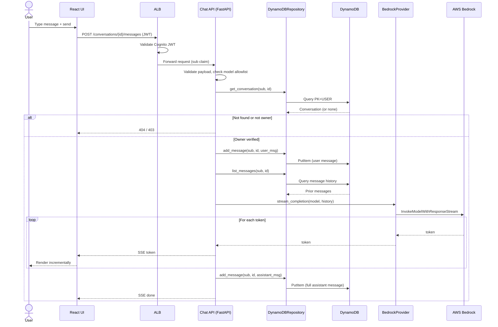

# AI Chat Service — Architecture

A small service where a user can chat with an LLM, with conversation history
persisted permanently. Built to demonstrate clean structure, clear seams, and a
realistic path to commercial use.

## 1. Architecture Overview

A small set of focused services, cleanly layered, matching a distributed /
microarchitecture style:

```
                        ┌──────────────────────┐
                        │   React + Tailwind    │  (SPA on S3 + CloudFront)
                        └──────────┬───────────┘
                                   │ HTTPS + JWT (Cognito tokens), SSE for streaming
                                   ▼
                        ┌──────────────────────┐
                        │   ALB                 │  (validates Cognito JWT)
                        └──────────┬───────────┘
                                   ▼
            ┌──────────────────────────────────────────────┐
            │      Chat API service (FastAPI on Fargate)    │
            │  - Conversation & message endpoints           │
            │  - AuthZ enforcement (owner = sub claim)      │
            │  - Orchestrates persistence + inference        │
            └───────┬───────────────────────────┬──────────┘
                    │                            │
          ┌─────────▼─────────┐        ┌─────────▼──────────┐
          │  LLM Integration   │       │   Data Access      │
          │  (LLMProvider IF → │       │  (Repository IF →  │
          │   BedrockProvider) │       │   DynamoDBRepo)    │
          └─────────┬─────────┘        └─────────┬──────────┘
                    ▼                            ▼
            ┌───────────────┐          ┌───────────────────┐
            │  AWS Bedrock  │          │     DynamoDB      │
            │ (model chosen │          │ single-table      │
            │  by user)     │          │                   │
            └───────────────┘          └───────────────────┘
```

The FastAPI service is split into three replaceable layers — this is the core
of the "evolvability" argument, and each seam is a place to split into a
separate service or swap a vendor without touching the rest:

1. **API layer** — routing, request/response schemas, auth enforcement, error
   mapping. Knows nothing about Bedrock or DynamoDB.
2. **LLM integration layer** — an `LLMProvider` interface with a
   `BedrockProvider` implementation. Swapping or adding a provider is one new
   class.
3. **Data access layer** — a `ConversationRepository` interface with a
   `DynamoDBRepository` implementation. Swapping the datastore is one new class.

## 2. Technology Choices

| Concern    | Choice                              | Justification                                                                      |
| ---------- | ----------------------------------- | --------------------------------------------------------------------------------- |
| Backend    | **Python + FastAPI**                | Async fits LLM latency, Pydantic validation, auto OpenAPI docs.                    |
| Inference  | **AWS Bedrock**                     | Managed, IAM-scoped, no third-party key rotation, data stays in-account.          |
| Model      | **User-selectable (allowlisted)**   | The user chooses the model; the service enforces a server-side allowlist.         |
| Database   | **DynamoDB (on-demand)**            | Serverless, single-digit-ms key access, scale-to-zero cost, structural isolation. |
| Auth       | **Amazon Cognito**                  | Managed user pool, issues JWTs; the `sub` claim is the tenancy key.               |
| Frontend   | **React + Tailwind**                | Component model fits chat; Tailwind for fast, consistent styling.                  |
| Compute    | **AWS Fargate**                     | Long-lived container streams tokens (SSE) naturally; no cold starts.              |
| IaC        | **AWS CDK**                         | Typed, testable infrastructure in one language alongside the app.                 |
| Packaging  | **Docker** per service              | Reproducible runnable solution; compose locally, Fargate in AWS.                  |
| Local dev  | **docker-compose** + DynamoDB Local + `FakeProvider` | Reviewer runs everything with no AWS account.                    |

### Why DynamoDB

- **Cost for this context:** on-demand billing + 25 GB free storage → an idle
  demo costs effectively nothing, vs. ~$20–45 to keep a serverless SQL engine
  warm for two weeks.
- **Access pattern fit:** chat is append-heavy, owner-scoped, key-based reads —
  DynamoDB's sweet spot.
- **Zero ops / predictable latency** at any scale.
- **Tenant isolation is structural** (partitioned by user) — see Security.

**Where SQL (Postgres + pgvector) would win** and how we'd switch: once we need
full-text search over history, ad-hoc analytics/billing queries, or semantic
search for RAG. The `ConversationRepository` seam is exactly where that swap
happens, so the choice is not a lock-in.

### Why Fargate (streaming)

Token streaming pushes us to Fargate. Lambda *can* stream (response streaming
via Function URLs), but with friction for this stack: API Gateway buffers and
would have to be bypassed, the FastAPI/Mangum adapter does not stream, and cold
starts hurt first-token latency. Fargate holds a long-lived connection, relays
Bedrock's `InvokeModelWithResponseStream` token-by-token over SSE with
FastAPI's `StreamingResponse`, and runs identically under docker-compose
locally.

## 3. Data Model — DynamoDB single-table design

Two entity types, one table, partitioned by user for isolation and efficient
access:

```
PK                    SK                          Attributes
USER#<sub>            CONV#<conversationId>       title, model, createdAt, updatedAt
USER#<sub>            CONV#<cid>#MSG#<ulid>        role(user|assistant), content, model, tokens, createdAt
```

- **List a user's conversations:** Query `PK = USER#<sub>` +
  `begins_with(SK, "CONV#")`, filter to conversation records.
- **Fetch messages in order:** Query `PK = USER#<sub>` +
  `begins_with(SK, "CONV#<cid>#MSG#")`. The ULID sort key yields chronological
  order for free.
- **Isolation is structural:** every item is physically keyed by the owner's
  `sub`; a query can only ever address one user's partition.

The chosen `model` is stored on the conversation (and per message) so history
is reproducible and auditable.

## 4. Class Diagram


## 5. Sequence Diagram — send a message (with streaming)



## 6. Core Flows (required capabilities)

| Requirement                | Endpoint                              | Behavior                                                                              |
| -------------------------- | ------------------------------------- | ------------------------------------------------------------------------------------ |
| Create a new conversation  | `POST /conversations`                 | Creates conversation owned by `sub`; stores chosen model.                             |
| Send message + get answer  | `POST /conversations/{id}/messages`   | Persist user msg → load history → stream from Bedrock (SSE) → persist assistant msg.  |
| Fetch previous messages    | `GET /conversations/{id}/messages`    | Ownership-checked partition query.                                                    |
| List conversations         | `GET /conversations`                  | Query the user's partition.                                                           |
| Persistent storage         | (all of the above)                    | User msg persisted before inference; full assistant reply persisted on stream end.   |

Partial-stream handling: if the client disconnects mid-stream, whatever was
generated is still persisted so history stays consistent.

## 7. Security — risks & mitigations

- **Cross-user data access (the named risk):** every record keyed by Cognito
  `sub`; the owner is derived from the validated JWT, **never** from client
  input. Repository methods take `owner_sub` as a mandatory argument, so the
  ownership scope is unavoidable. Even a guessed `conversationId` only queries
  the attacker's own partition and returns nothing.
- **Authentication:** Cognito JWTs validated on every request (signature,
  issuer, audience, expiry) at the ALB and in middleware.
- **Model abuse / cost control:** server-side model allowlist; input length
  limits; per-user rate limiting.
- **Prompt injection:** model output treated as untrusted text (rendered, never
  executed); system prompt isolated from user content.
- **Secrets:** no long-lived LLM keys — Bedrock and DynamoDB accessed via IAM
  roles; Cognito config in SSM / Secrets Manager.
- **Transport / at rest:** HTTPS everywhere; DynamoDB encryption at rest (KMS);
  least-privilege IAM (only its table and `bedrock:InvokeModel*`).
- **Validation:** Pydantic schemas reject malformed payloads at the edge.
- **PII / GDPR path:** retention policy plus per-user delete/export endpoints as
  the compliance roadmap.

## 8. Error Handling

- **Layered exceptions:** domain errors (`ConversationNotFound`, `NotOwner`)
  mapped to HTTP codes (404 / 403) by a single handler; business logic never
  builds HTTP responses.
- **Upstream resilience:** Bedrock calls wrapped with timeouts and bounded
  retries/backoff for throttling; a clear `503` if inference is unavailable —
  the user's message is still persisted so nothing is lost.
- **Consistent envelope:** `{ "error": { "code", "message" } }`; internal
  details logged, never leaked to clients.
- **Idempotency:** request-id / idempotency key on message sends to survive
  retries.

## 9. SDLC / Operations

- **Repo:** monorepo — `services/chat-api/`, `frontend/`, `infra/` (CDK), root
  `docker-compose.yml`.
- **IaC:** **AWS CDK** provisions Cognito, DynamoDB, ALB/Fargate, IAM, S3 +
  CloudFront.
- **CI/CD:** GitHub Actions — ruff, mypy, pytest, build image, `cdk deploy`.
- **Testing:** unit tests against the repository/provider *interfaces* with
  fakes (no AWS), plus thin integration against DynamoDB Local.
- **Observability:** structured logging, CloudWatch metrics/traces, propagated
  request ids.
- **Config:** 12-factor — env vars (table name, Cognito pool/client ids, region,
  allowed model ids) validated at startup via a Pydantic `Settings` object.

## 10. Path to Commercial Use

- **LLMProvider interface** → multi-provider, model routing, fallback.
- **Repository interface** → swap to Postgres + pgvector when search /
  analytics / RAG arrive.
- **Per-service Docker images** → split LLM orchestration out, add
  billing/usage-metering, scale independently.
- **Cognito groups/claims** → role-based authorization drops in without
  re-architecting.
